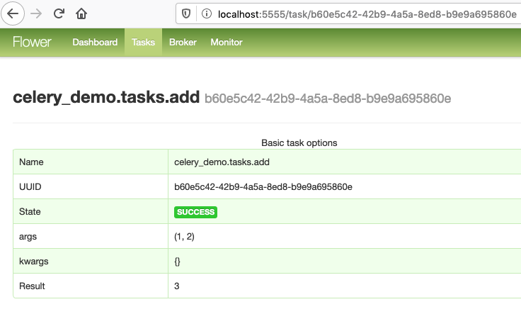

## Celery Demo
Requirements:
* python
* rabbitmq
```
git clone https://github.com/vinny-santaiti/celery_demo.git
cd celery_demo
python3 -m venv .env
source .env/bin/activate
pip install -r requirements.txt
pip freeze
cd ..
```
Run each command in one level up from project folder
in seperate terminal tabs:
1. worker - start celery and wait for task to run 
1. main - run python program
1. flower - (optional) monitor celery in web browser

```
source celery_demo/.env/bin/activate
celery -A celery_demo.celery_app worker --loglevel=info
```
Output:
```
[config]
.> app:         my_celery:0x103175e50
.> transport:   amqp://guest:**@localhost:5672//
.> results:     rpc://
.> concurrency: 8 (prefork)
.> task events: OFF (enable -E to monitor tasks in this worker)

[queues]
.> celery           exchange=celery(direct) key=celery


[tasks]
  . celery_demo.tasks.add

[2020-07-11 08:26:00,303: INFO/MainProcess] Connected to amqp://guest:**@127.0.0.1:5672//
[2020-07-11 08:26:00,322: INFO/MainProcess] mingle: searching for neighbors
[2020-07-11 08:26:01,359: INFO/MainProcess] mingle: all alone
[2020-07-11 08:26:01,389: INFO/MainProcess] celery@localhost ready.
[2020-07-11 08:26:03,101: INFO/MainProcess] Events of group {task} enabled by remote.
[2020-07-11 08:26:06,011: INFO/MainProcess] Received task: celery_demo.tasks.add[bc13dd1d-083f-4991-b8f0-d33b1ac860c7]
[2020-07-11 08:26:06,013: WARNING/ForkPoolWorker-8] task begins
[2020-07-11 08:26:09,015: WARNING/ForkPoolWorker-8] task finished
[2020-07-11 08:26:09,036: INFO/ForkPoolWorker-8] Task celery_demo.tasks.add[bc13dd1d-083f-4991-b8f0-d33b1ac860c7] succeeded in 3.0233783579999995s: 3
```
### Main
```
source celery_demo/.env/bin/activate
python -m celery_demo.main
Task finished? False
Task result: None
Task finished? True
Task result: 3
```
### Flower
```
source celery_demo/.env/bin/activate
celery -A celery_demo.celery_app flower
```
Output:
```
[I 200711 08:24:03 command:140] Visit me at http://localhost:5555
[I 200711 08:24:03 command:145] Broker: amqp://guest:**@localhost:5672//
[I 200711 08:24:03 command:148] Registered tasks:
    ['celery.accumulate',
     'celery.backend_cleanup',
     'celery.chain',
     'celery.chord',
     'celery.chord_unlock',
     'celery.chunks',
     'celery.group',
     'celery.map',
     'celery.starmap',
     'celery_demo.tasks.add']
[I 200711 08:24:03 mixins:229] Connected to amqp://guest:**@127.0.0.1:5672//
```
Open in web browser: localhost:5555

